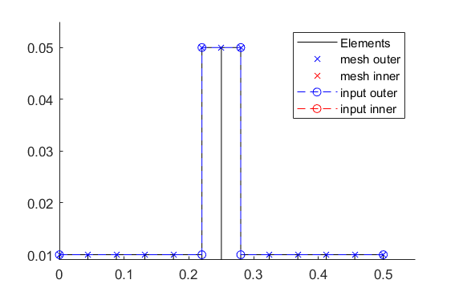

Simulation_file_example
=======================
This is a simple example for the Simulation_script of a Laval rotor

.. literalinclude:: /../Examples/Simple_Laval/Simulation_Modal.m
    :language: matlab
    :linenos:
    :Start-after: Clean up
    :End-before: Import

.. literalinclude:: /../Examples/Simple_Laval/Simulation_Modal.m
    :language: matlab
    :linenos:
    :Start-after: Import
    :End-before: Compute Rotor

.. literalinclude:: /../Examples/Simple_Laval/Simulation_Modal.m
    :language: matlab
    :linenos:
    :Start-after: Compute Rotor
    :End-before: Running Time Simulation

.. literalinclude:: /../Examples/Simple_Laval/Simulation_Modal.m
    :language: matlab
    :linenos:
    :Start-after: Running Time Simulation
    :End-before: Plot results

.. literalinclude:: /../Examples/Simple_Laval/Simulation_Modal.m
    :language: matlab
    :linenos:
    :Start-after: Plot results

