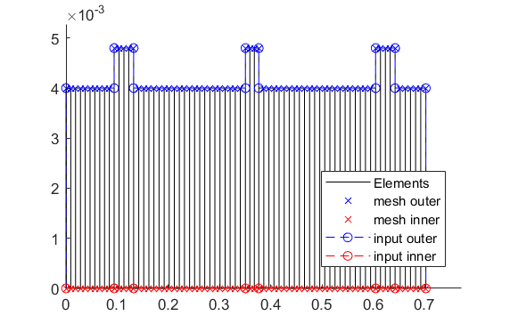
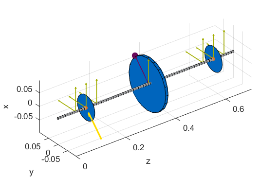
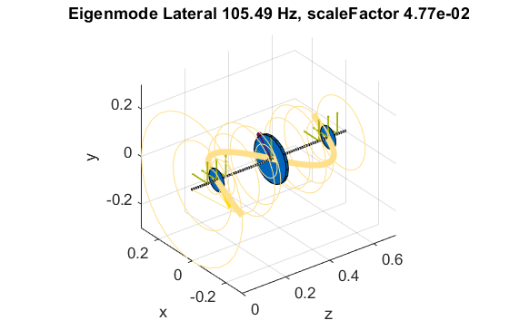
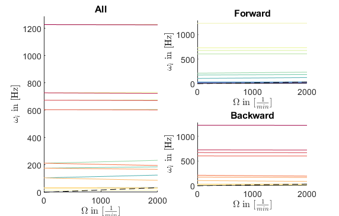
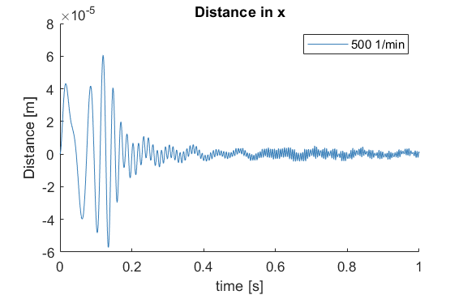
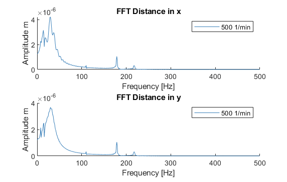

Simulation file for the MBTR
============================

This is a simulation file for an investigation (approximation with spring-damper) of a real AMB test rig. Of interest is
the behaviour of the rotor in steady state (modal analysis) and in run-ups (campbell analysis) as well
as the stationary time behaviour (at 500 rpm) resulting from an external excitation.

Closing all former figures and cleaning the workspace.

.. literalinclude:: /../Simulationen/MLPS_AMB_Modalanalyse/Simulation.m
    :language: matlab
    :linenos:
    :Start-after: Clean up
    :End-before: Import

Import of the file path and  of the corresponding cnfg-file.

.. literalinclude:: /../Simulationen/MLPS_AMB_Modalanalyse/Simulation.m
    :language: matlab
    :linenos:
    :Start-after: Import
    :End-before: Compute Rotor

Assembly and visualization of the model

.. literalinclude:: /../Simulationen/MLPS_AMB_Modalanalyse/Simulation.m
    :language: matlab
    :linenos:
    :Start-after: Compute Rotor
    :End-before: Running system analyses

2D side view of the rotor (left) and 3D-isometry (right). The steps in the rotor geometry (in the 2D side view)
represent the reinforcements (check corresponding cnfg-file) of the main rotor and not the disc component as seen in the 3D-isometry.

Running of the system analyses (modal analysis and campbell analysis) with visualization.

.. literalinclude:: /../Simulationen/MLPS_AMB_Modalanalyse/Simulation.m
    :language: matlab
    :linenos:
    :Start-after: Running system analyses
    :End-before: Running Time Simulation

Representation of the 10th eigenmode (upscaled with orbits, see code line 15) of the rotor (left) and the 
campbell diagram (right) of the rotor

Running of the time simulation (at 500 rpm for 1 sec) with unbalance and external 
excitation (Forward whirl sweep force) with visualization.

.. literalinclude:: /../Simulationen/MLPS_AMB_Modalanalyse/Simulation.m
    :language: matlab
    :linenos:
    :Start-after: Running Time Simulation

Time signal (x-direction) of the eddy-current sensor on the left AMB (left)
and the corresponding Fourier analysis (right)

