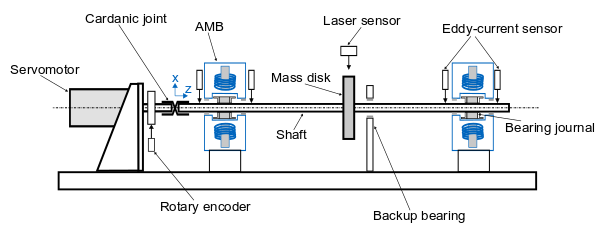

MBTR test rig with spring damper elements as bearings
=====================================================

This code example is based on a real magnetic bearing test rig (MBTR).
In this MBTR a rotor is mounted on active magnetic bearings (AMB's). The simulations however
uses spring-damper elements to approximate the magnetic bearing behaviour.

.. .. toctree::
   .. :maxdepth: 2

   .. ./MBTR/Config_file_MBTR
   .. ./MBTR/Simulation_file_MBTR

.. include:: MBTR/Config_file_MBTR.rst
.. include:: MBTR/Simulation_file_MBTR.rst