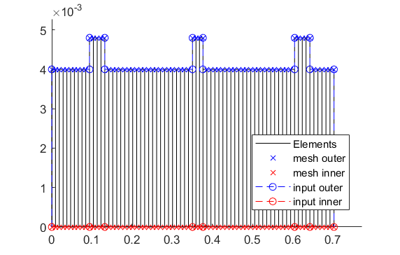

Simulation file for the MBTR with AMB and controller
====================================================

This is a simulation file for an investigation of a real AMB test rig. Of interest is
the stationary time behaviour (at 0 rpm) resulting from external excitations.

Closing all former figures and cleaning the workspace.

.. literalinclude:: /../Simulationen/MLPS_pid/Simulation_Time.m
    :language: matlab
    :linenos:
    :Start-after: Clean up
    :End-before: Import

Import of the file path and  of the corresponding cnfg-file.

.. literalinclude:: /../Simulationen/MLPS_pid/Simulation_Time.m
    :language: matlab
    :linenos:
    :Start-after: Import
    :End-before: Compute Rotor

Assembly and visualization of the model

.. literalinclude:: /../Simulationen/MLPS_pid/Simulation_Time.m
    :language: matlab
    :linenos:
    :Start-after: Compute Rotor
    :End-before: Running Time Simulation

2D side view of the rotor (left) and 3D-isometry (right). The steps in the rotor geometry (in the 2D side view)
represent the reinforcements (check corresponding cnfg-file) of the main rotor and not the disc component as seen in the 3D-isometry.

Running of the time simulation (at 0 rpm for 1 sec) with
external excitation (random on both AMB's only in x-direction) with visualization.

.. literalinclude:: /../Simulationen/MLPS_pid/Simulation_Time.m
    :language: matlab
    :linenos:
    :Start-after: Running Time Simulation

Time signal (x-direction) of the eddy-current sensor on the left AMB (left)
and the corresponding Fourier analysis (right)

