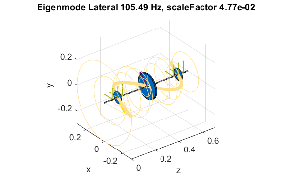

Introduction
============

.. AMrotor is a matlab-based object-oriented rotordynamic toolbox with active magnetic bearing (AMB-) extension.

.. image:: examples/Rotor_geometry_3D_MBTR.png
    :width: 48 %

During the last years, a MATLAB® toolbox for simulation of rotating machines has been
developed at the Chair of Applied Mechanics of the Technical University of Munich. For
the geometry of a rotor, a 2D silhouette can be given by a simple point description.
Then, a mesh of beam elements is created which are assembled into a MCK-model.
In the next step, different components like bearings, external forces and loads (e.g.
unbalance) are added to the system. It is also possible to add time-variant loads
and nonlinear or even active components, e.g. magnetic bearings. Different types
of analysis can then be performed, like modal analysis, Campbell diagrams or time
integration. The whole toolbox is programmed in an object oriented way. The code
is meant to be a research code which focuses more on easy architecture than on
execution performance. The goal is to enable easy implementation of new components
with own methods and testing them.

Paper with reference to the toolbox and more specific information about the mathematical background are:

.. [1] AMrotor – A MATLAB Toolbox for the Simulation of Rotating Machinery, Johannes Maierhofer, M.Kreutz, T.Mulser, T. Thümmel, D. Rixen. 
.. [2] Comparison of different time integration schemes and application to a rotor system with magnetic bearings in Matlab, Michael Kreutz, J. Maierhofer, T. Thümmel, D. Rixen