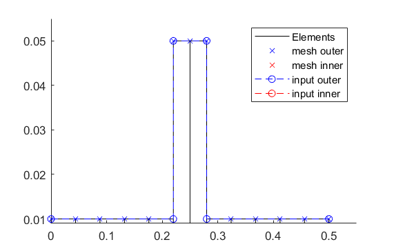

.. _Tutorial:

########
Tutorial
########

******
Basics
******

A very brief tutorial of a Laval-rotor should show the working principle of AMrotor for building a rotordynamic model,
followed by examples referring to the available analysis methods. To see more complex models check :ref:`Examples`.

To run a simulation with AMrotor, two scripts are necessary:

* Configuration-script, contains all the necessary parameters for the subsequent simulation. These parameters contain
  information about the rotor and all additional components. 

* Simulation-script, contains the assembly and the desired analyses applied on the model.

*********************
How to build a model?
*********************

The scope of this tutorial is to build a simple Laval-rotor model with two simple radial bearings and
a disc in the center modelled as part of the rotor (no extra disc component). The building of the model takes 
part in both scripts.

Configuration script
++++++++++++++++++++++++++

The following config-script can be copied-and-pasted into an empty matlab script. The script
must then be saved into the AMrotor path. For this tutorial we save the script with the name "Config_Tutorial"
in the Simulation(Simulationen)-folder of AMrotor. Eventually the folder has to be added
to the path. The name of the config-script is important, since it's later
needed in the simulation-script. By running the saved script the config-struct (cnfg) will be build.

For this simple example not all components (only rotor and bearings) are necessary, nevertheless it's essential that all
components (sensors, pid-controllers, active magnetic bearings, ...) are initialized to prevent errors.

.. code-block:: matlab 
   :linenos:
  
    %% Configuration

    %% ================Rotor===================================================
    %% Building of the rotor struct
    cnfg.cnfg_rotor.name = 'Simple example: Laval-Rotor';
    % All units in SI 
    cnfg.cnfg_rotor.material.name = 'steel';
    cnfg.cnfg_rotor.material.e_module = 211e9;  %[N/m^2]
    cnfg.cnfg_rotor.material.density  = 7860;   %[kg/m^3]
    cnfg.cnfg_rotor.material.poisson  = 0.3;    %[-]
    % Rayleigh damping: D=alpha1*K + alpha2*M
    cnfg.cnfg_rotor.material.damping.rayleigh_alpha1= 1e-5;
    cnfg.cnfg_rotor.material.damping.rayleigh_alpha2= 10;

    %% Rotor Config
    rW = 10e-3; % Radius of the shaft [m]
    rS = 50e-3; % Radius of the disc [m]
    % Format of the geometry definition: {[z, r_outer, r_inner], ...} without..
    % start- and end-node
    cnfg.cnfg_rotor.geo_nodes = {[0 rW 0], [0.220 rW 0], [0.220 rS 0], ...
    [0.280 rS 0], [0.280 rW 0], [0.500 rW 0]};
    clear rW rS

    %% FEM Config
    cnfg.cnfg_rotor.mesh_opt.name = 'Mesh 1';
    % Number of refinement steps between d_min and d_max
    cnfg.cnfg_rotor.mesh_opt.n_refinement = 10;
    cnfg.cnfg_rotor.mesh_opt.d_min = 0.001;
    cnfg.cnfg_rotor.mesh_opt.d_max = 0.05;
    % Definition of the element radius, if the geometry radius is not ...
    % constant in this section. Options: symmetric, mean, upper sum, lower sum
    cnfg.cnfg_rotor.mesh_opt.approx = 'symmetric';

    %% ====================Sensors============================================
    %% Initialization of the sensor section in the struct
    cnfg.cnfg_sensor=[];
    count = 0;

    %% =========================Components====================================
    %% Initialization of the components section in the struct
    count = 0;
    cnfg.cnfg_component = [];

    %% Bearings
    count = count + 1;
    cnfg.cnfg_component(count).name = 'RadBearing1';
    cnfg.cnfg_component(count).type='Bearings';
    cnfg.cnfg_component(count).subtype='SimpleBearing';
    cnfg.cnfg_component(count).position=0e-3; % [m]
    cnfg.cnfg_component(count).stiffness=1e6; % [N/m]
    cnfg.cnfg_component(count).damping = 0; % [Ns/m]
    count = count + 1;
    cnfg.cnfg_component(count).name = 'RadBearing2';
    cnfg.cnfg_component(count).type='Bearings';
    cnfg.cnfg_component(count).subtype='SimpleBearing';
    cnfg.cnfg_component(count).position=500e-3; % [m]
    cnfg.cnfg_component(count).stiffness=1e6; % [N/m]
    cnfg.cnfg_component(count).damping = 0; % [Ns/m]

    %% =========================Loads=========================================
    %% Initialization of the load section in the struct
    cnfg.cnfg_load=[];
    count = 0;

    %% ========================PID-controller==================================
    %% Initialization of the pid-controller section in the struct
    cnfg.cnfg_pid_controller=[];
    count = 0;

    %% ======================Active Magnetic Bearing===========================
    %% Initialization of the active magnetic bearing section in the struct
    cnfg.cnfg_activeMagneticBearing = [];
    count = 0;

Simulation script
+++++++++++++++++++++++++

After setting up the config-script the simulation-script has to be made. The following part
of the simulation-script contains the asembly and the visualization of the model and can be copied-and-pasted into an
empty Matlab script.
Important for this tutorial is that the called config-script name in the simulation scipt is consistent to "Config_Tutorial" (line 9).
The simulation script can be saved in the same folder as the corresponding config-script and then be executed.

.. code-block:: matlab 
   :linenos:
  
    %% Simulation
    %% Clean up
    close all
    clear all
    % clc

    %% Import and formating of the figures
    import AMrotorSIM.* % path
    Config_Tutorial % corresponding cnfg-file
    Janitor = AMrotorTools.PlotJanitor(); % Instantiation of class PlotJanitor
    Janitor.setLayout(2,3); %Setting layout of the figures

    %% Assembly of the rotordynamic model
    r=Rotorsystem(cnfg,'Laval-Rotor'); % Instantiation of class Rotorsystem
    r.assemble; % Assembly of the model parts, considering the ...
            % components (sensors,..) from the cnfg-file
    r.rotor.assemble_fem; % assembly of the global (rotor) system ...
                      % matrices: M, D, G, K

    %% Visualization of the assembled rotor model
    r.show; % lists the associated components of the model in teh Matlab ...
        % Command Window
    r.rotor.show_2D(); % Plot of a side view of the rotor elements
    g=Graphs.Visu_Rotorsystem(r); % Instantiation of class Visu_Rotorsystem
    g.show(); % Plot of a 3D-isometry of the rotor with sensors, loads,...
    Janitor.cleanFigures();

After the execution of the simulation-script the assembled rotor model will be visualized:

More sophisticated examples with subsequent inegrated analysis methods can be found in :ref:`Examples`.

************************************
How to make a **Campbell** analysis?
************************************

.. note::  The following analysis method is not working with the previous "How to build a model?" example, since some
           components (eg. sensors, loads, ...) are missing in this minimal example. For further information check :ref:`Examples`. 
           
           Generally, analysis methods
           are defined in the simulation-script and can be devided into two sub-blocks:

           * Calculation code block

           * Visualization code block

The following code snippet should show how the two code-blocks for a Cambell analysis would look like.

.. code-block:: matlab 
   :linenos:

    %% Calculation
    cmp = Experiments.Campbell(r); % Instantiation of class Campbell for calculation
    cmp.set_up(0:2e2:2e3,20); % Set up (omega range in 1/min, #modes)
    cmp.calculate(); % Calculation

    %% Visualization
    cmpDiagramm = Graphs.Campbell(cmp); % Instantiation of class Campbell for visualization
				% of the obtained results
    cmpDiagramm.print_damping_zero_crossing(); % Prints in the Command Window
    cmpDiagramm.print_critical_speeds() % Prints in the Command Window
    cmpDiagramm.set_plots('all'); % Plots the visualization (Figures)
    Janitor.cleanFigures(); % Formating of the figures

*********************************
How to make a **Modal** analysis?
*********************************

.. note::  The following analysis method is not working with the previous "How to build a model?" example, since some
           components (eg. sensors, loads, ...) are missing in this minimal example. For further information check :ref:`Examples`. 
           
           Generally, analysis methods
           are defined in the simulation-script and can be devided into two sub-blocks:

           * Calculation code block

           * Visualization code block

The following code snippet should show how the two code-blocks for a Modal analysis would look like.

.. code-block:: matlab 
   :linenos:

    %% Calculation
    m=Experiments.Modalanalyse(r); % Instantiation of class Modalanalyse for calculation
    m.calculate_rotorsystem(16,0); % Calculation (#modes, rotation speed)

    %% Visualization 
    esf= Graphs.Eigenschwingformen(m); % Instantiation of class Eigenschwingformen for 
				% visualization of the obtained results
    esf.print_frequencies(); % Prints EF in the Command Window
    esf.plot_displacements(); % Plots the 2D mode shapes
    % esf.set_plots('half','Overlay'); % Plots of the odd-numbered eigenmodes .. 
                                % in overlay with the original rotor
    esf.set_plots(10,'Overlay','Skip',5,'tangentialPoints',30,'scale',3); % ...
				% Plot of the 3D mode shapes
    Janitor.cleanFigures(); % Formating of the figures

.. _Stationary:

**********************************************
How to make a **Stationary** time integration?
**********************************************

.. note::  The following analysis method is not working with the previous "How to build a model?" example, since some
           components (eg. sensors, loads, ...) are missing in this minimal example. For further information check :ref:`Examples`. 
           
           Generally, analysis methods
           are defined in the simulation-script and can be devided into two sub-blocks:

           * Calculation code block

           * Visualization code block

In a stationary time integration the angular velocity of the rotor is kept at a constant
value.

.. code-block:: matlab 
   :linenos:

    %% Calculation
    St_Lsg = Experiments.Stationaere_Lsg(r,[500],[0:0.001:0.025]); % In...
        %stantiation of class Stationaere_Lsg
    St_Lsg.compute_ode15s_ss; % ode15s - method
    %St_Lsg.compute_newmark; % newmark - method

    %% Visualization
    t = Graphs.TimeSignal(r, St_Lsg); % Instantiation of class TimeSignal
    o = Graphs.Orbitdarstellung(r, St_Lsg); % Instantiation of class ...
                                     % Orbitdarstellung
    f = Graphs.Fourierdarstellung(r, St_Lsg); % Instantiation of class ...
                                       % Fourierdarstellung
    fo = Graphs.Fourierorbitdarstellung(r, St_Lsg); % Instantiation of class ..
                                             % Fourierorbitdarstellung
    w = Graphs.Waterfalldiagramm(r, St_Lsg); % Instantiation of class ...
                                      % Waterfalldiagramm
    w2 = Graphs.WaterfalldiagrammTwoSided(r, St_Lsg); % Instantiation of ...
                                       % class WaterfalldiagrammTwoSided
    for sensor = r.sensors % Loop over all sensors for plotting the sensor results
          t.plot(sensor); % Time signal
          o.plot(sensor); % Orbits
          f.plot(sensor); % Fourier
          fo.plot(sensor,1); % Fourierorbit 1st order
          fo.plot(sensor,2); % Fourierorbit 2nd order
          w.plot(sensor); % Waterfall
          w2.plot(sensor); % Waterfall 2sided
         Janitor.cleanFigures(); % Formating of the figures
    end

.. _Runup:

******************************************
How to make a **Run-up** time integration?
******************************************

.. note::  The following analysis method is not working with the previous "How to build a model?" example, since some
           components (eg. sensors, loads, ...) are missing in this minimal example. For further information check :ref:`Examples`. 
           
           Generally, analysis methods
           are defined in the simulation-script and can be devided into two sub-blocks:

           * Calculation code block

           * Visualization code block

.. code-block:: matlab 
   :linenos:

    %% Calculation
    Runup = Experiments.Hochlaufanalyse(r,[0,1e3],(0:0.001:0.2)); % In...
        %stantiation of class Hochlaufanalyse (Runup)
    Runup.compute_ode15s_ss % ode15s - method

    %% Visualization
    t = Graphs.TimeSignal(r, Runup); % Instantiation of class TimeSignal
    o = Graphs.Orbitdarstellung(r, Runup); % Instantiation of class ...
                                     % Orbitdarstellung
    f = Graphs.Fourierdarstellung(r, Runup); % Instantiation of class ...
                                       % Fourierdarstellung
    fo = Graphs.Fourierorbitdarstellung(r, Runup); % Instantiation of class ..
                                             % Fourierorbitdarstellung
    w = Graphs.Waterfalldiagramm(r, Runup); % Instantiation of class ...
                                      % Waterfalldiagramm
    w2 = Graphs.WaterfalldiagrammTwoSided(r, Runup); % Instantiation of ...
                                       % class WaterfalldiagrammTwoSided
    for sensor = r.sensors % Loop over all sensors for plotting the sensor results
          t.plot(sensor); % Time signal
          o.plot(sensor); % Orbits
          f.plot(sensor); % Fourier
          fo.plot(sensor,1); % Fourierorbit 1st order
          fo.plot(sensor,2); % Fourierorbit 2nd order
          w.plot(sensor); % Waterfall
          w2.plot(sensor); % Waterfall 2sided
         Janitor.cleanFigures(); % Formating of the figures
    end

*******************************************
How to get **FRF's** from the rotor system?
*******************************************

.. note::  The following analysis method is not working with the previous "How to build a model?" example, since some
           components (eg. sensors, loads, ...) are missing in this minimal example. For further information check :ref:`Examples`. 
           
           Generally, analysis methods
           are defined in the simulation-script and can be devided into two sub-blocks:

           * Calculation code block

           * Visualization code block

.. code-block:: matlab 
   :linenos:

    %% Calculation
    frf=Experiments.Frequenzgangfunktion(r,'FRF'); % Instantiation of ... 
                        % class Frequenzgangfunktion
    type = 'd'; % FRF type: displ. 'd', veloc. 'v', accel. 'a'
    inPos = [0,100,200]*1e-3; % Input positions on the rotor axis
    outPos = 100e-3; % Output positions along the rotor axis
    f = 1:2:100; % Frequency resolution of the FRF
    rpm = 0; % Rotational speed
    [f,H]=frf.calculate(f,inPos,outPos,type,rpm,{'u_x','u_y','psi_x'}, {'u_x','psi_x'}); % ...
	              % Calculation of the FRF's from the three input ... 
                      % directions {'u_x','u_y','psi_x'} to the two ... 
                      % output directions {'u_x','psi_x'} at the ...
                      % corresponding positions
    [deltaIn,deltaOut]=frf.print_distance_delta; % Plot of the gap between ...
                      % the desired positions along the rotor axis and ...
                      % the closest node position in the Command Window.
    %% Visualization
    visufrf = Graphs.Frequenzgangfunktion(frf); % Instantiation of ... 
                        % class Frequenzgangfunktion for figures
    visufrf.set_plots('amplitude','db') % Amplitude plot of all FRF's
    visufrf.set_plots('phase','db') % Phase plot of all FRF's
    visufrf.set_plots('bode','log','deg') % Bode plot of all FRF's
    visufrf.set_plots('nyquist') % Nyquist plot of all FRF's
    Janitor.cleanFigures(); % Formating of the figures

***********************************************************
How to get **FRF's from time signals** of the rotor system?
***********************************************************

.. note::  The following analysis method is not working with the previous "How to build a model?" example, since some
           components (eg. sensors, loads, ...) are missing in this minimal example. For further information check :ref:`Examples`. 
           
           Generally, analysis methods
           are defined in the simulation-script and can be devided into two sub-blocks:

           * Calculation code block

           * Visualization code block

FRF's from time signals is based on results from prviously performed time integrations (check Stationary: :ref:`Stationary` or Runup: :ref:`Runup` 
containing the desired rotation speed (rpm).

.. code-block:: matlab 
   :linenos:

    %% Calculation
    St_Lsg; % Runup; %Results from time integration are necessary (Stationary or Runup)
    frf = Experiments.FrequenzgangfunktionTime(St_Lsg); % Instantiation ...
                                        % of class FrequenzgangfunktionTime
    frf.calculate(r.sensors(2),r.sensors(1),[1100],'u_x','u_x',4,'boxcar'); % Calculation

    %% Visualization
    visufrf = Graphs.Frequenzgangfunktion(frf);
    visufrf.set_plots('bode','log','deg','coh');